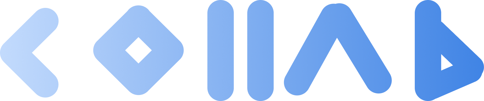

# Collab

<p align="center">
  
</p>

<p align="center">
  <strong>Real-time Collaborative Coding Platform</strong>
</p>

<p align="center">
  <a href="#features">Features</a> •
  <a href="#getting-started">Getting Started</a> •
  <a href="#installation">Installation</a> •
  <a href="#project-structure">Project Structure</a> •
  <a href="#contributing">Contributing</a> •
  <a href="#license">License</a>
</p>

## Features

- **Live Code Collaboration**: Work with teammates on the same file in real-time with color-coded cursors
- **Project Management**: Create, organize, and manage your coding projects with ease
- **Advanced Editor**: Powered by Monaco Editor (same as VS Code) with syntax highlighting and auto-completion
- **Version Control**: Track changes and restore previous versions of your code
- **GitHub Integration**: Seamlessly connect with your GitHub repositories
- **In-Browser Code Execution**: Run JavaScript and Python code directly in your browser
- **Team Collaboration**: Invite team members and set custom permissions

## Getting Started

### Prerequisites

- Node.js (v16.x or higher)
- npm (v8.x or higher)
- Git

### Installation

```bash
# Clone the repository
git clone https://github.com/yourusername/collab.git

# Navigate to the project directory
cd collab

# Install dependencies
npm install

# Set up environment variables
cp .env.example .env.local
# Edit .env.local with your configuration

# Start the development server
npm run dev
```

After starting the development server, open [http://localhost:3000](http://localhost:3000) in your browser to see the application.

## Project Structure

```
collab/
├── public/             # Static assets
├── src/
│   ├── app/            # Next.js app router pages
│   │   ├── api/        # API routes
│   │   ├── auth/       # Authentication pages
│   │   ├── dashboard/  # Dashboard pages
│   │   ├── docs/       # Documentation pages
│   │   └── ...         # Other pages
│   ├── components/     # React components
│   │   ├── editor/     # Code editor components
│   │   ├── project/    # Project management components
│   │   ├── ui/         # UI components
│   │   └── ...         # Other components
│   ├── lib/            # Utility functions and libraries
│   ├── hooks/          # Custom React hooks
│   ├── types/          # TypeScript type definitions
│   └── styles/         # Global styles
├── .env.local        # Example environment variables
├── next.config.js      # Next.js configuration
├── package.json        # Project dependencies
└── tsconfig.json       # TypeScript configuration
```

## Technology Stack

- **Frontend**: Next.js, React, TypeScript, Tailwind CSS
- **UI Components**: Shadcn UI, Framer Motion
- **Icons**: React Icons
- **Authentication**: GitHub OAuth
- **Database**: Mongodb

## Contributing

We welcome contributions from the community! Here's how you can contribute:

### Setting Up for Development

1. Fork the repository
2. Clone your fork: `git clone https://github.com/JAYANTJOSHI001/collab.git`
3. Create a new branch: `git checkout -b feature/your-feature-name`
4. Make your changes
5. Run tests: `npm test`
6. Commit your changes: `git commit -m "Add your feature"`
7. Push to your branch: `git push origin feature/your-feature-name`
8. Open a Pull Request

### Contribution Guidelines

- Follow the existing code style and conventions
- Write clear, descriptive commit messages
- Include tests for new features
- Update documentation for any changes
- Make sure all tests pass before submitting a PR

### Development Workflow

1. Pick an issue from the issue tracker or create a new one
2. Discuss the implementation approach in the issue
3. Implement your changes
4. Write tests for your changes
5. Submit a PR with a clear description of the changes

### Code Style

- We use ESLint and Prettier for code formatting
- Run `npm run lint` to check for linting issues
- Run `npm run format` to automatically fix formatting issues

## Security

We take security seriously:
- All code is encrypted in transit and at rest
- Private projects remain completely private
- No sharing of code with third parties

## Support

For bug reports or feature requests:
- Submit an issue on our [GitHub repository](https://github.com/JAYANTJOSHI001/collab/issues)
- Contact support at jayantjoshi0001@gmail.com

## Roadmap

Our upcoming features and improvements:
- Offline mode with sync capabilities
- Mobile app for on-the-go collaboration
- Additional language support for code execution
- Enhanced project templates
- AI-powered code suggestions

## License

[MIT License](LICENSE)

## Frameworks & Languages Used

- [Next.js](https://nextjs.org/)
- [React](https://reactjs.org/)
- [Tailwind CSS](https://tailwindcss.com/)
- [Monaco Editor](https://microsoft.github.io/monaco-editor/)
- [Framer Motion](https://www.framer.com/motion/)
- [Shadcn UI](https://ui.shadcn.com/)

